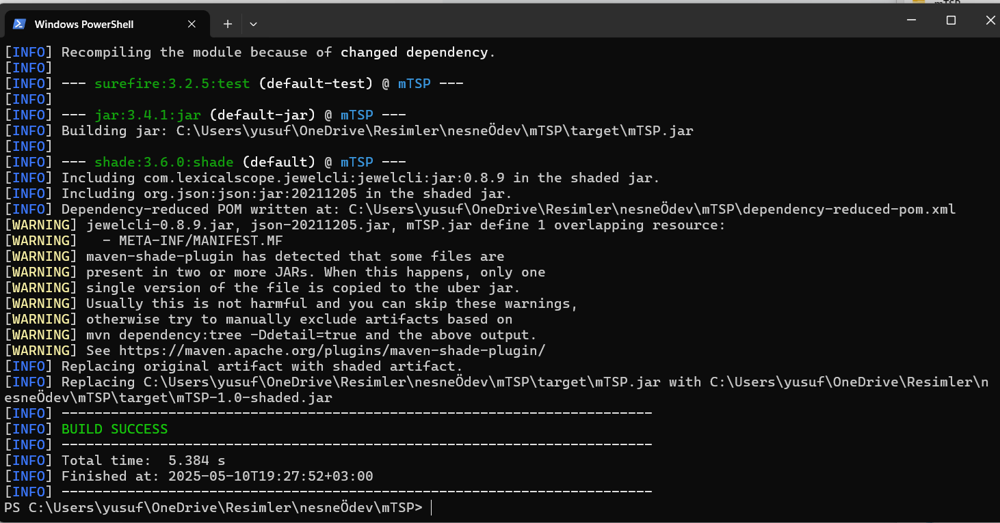
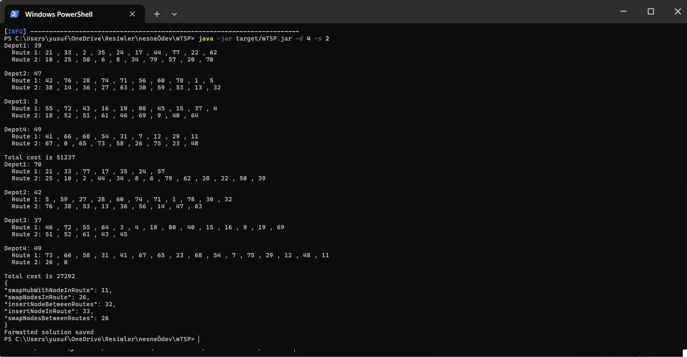
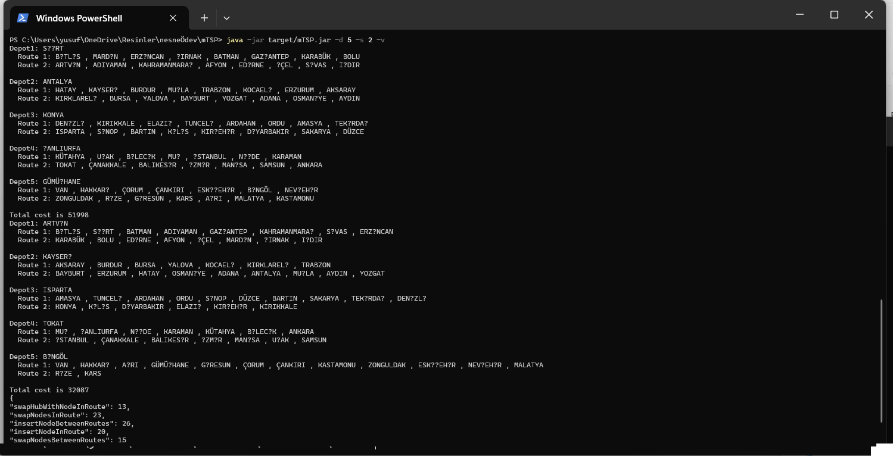
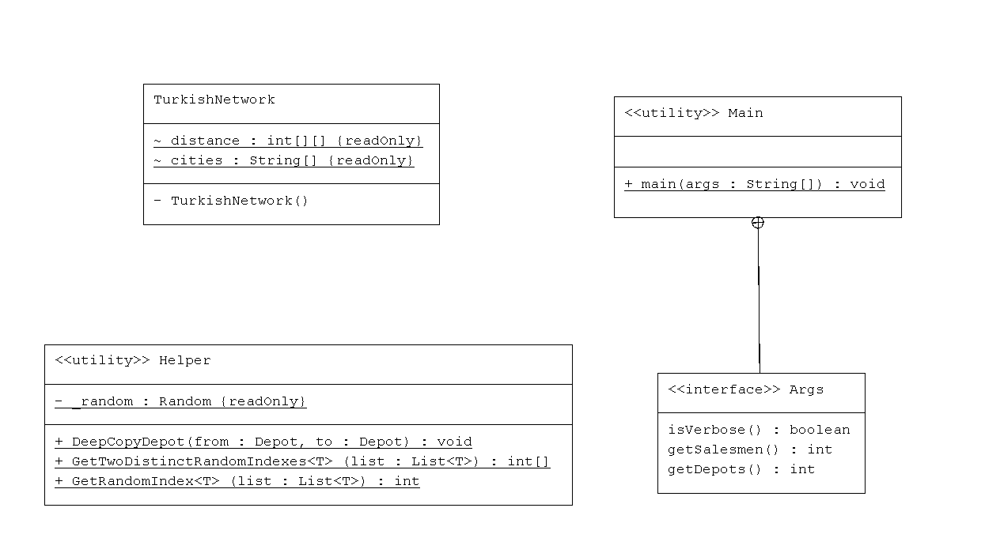

# Examples
`mvn clean package`

`java -jar target/mTSP.jar -d 4 -s 2`

`java -jar target/mTSP.jar -d 4 -s 2 -v`

# UML'S
Command Pattern usage

Main & Others

Solver class


# The Multiple Traveling Salesman Problem

The [Multiple Traveling Salesman Problem](https://neos-guide.org/content/multiple-traveling-salesman-problem-mtsp) (*m*TSP) in which more than one salesman is allowed is a generalization of the Traveling Salesman Problem (TSP).
Given a set of cities, one depot (where *m* salesmen are located), and a cost metric, the objective of the *m*TSP is to determine a set of routes for *m* salesmen so as to minimize the total cost of the *m* routes. 
The cost metric can represent cost, distance, or time. The requirements on the set of routes are:

* All of the routes must start and end at the (same) depot.
* There must be at least one city (except depot) in each route.
* Each city must be visited exactly once by only one salesman.

**Multiple depots**: Instead of one depot, the multi-depot *m*TSP has a set of depots, with m<sub>j</sub> salesmen at each depot *j*. 
In the *fixed destination* version, a salesman returns to the same depot from which he started.

Please keep in mind that this project is based on the 81 cities of **Turkey** while examining sample solutions given below.

## Part-I

In this part of the homework, we will generate 100,000 random solutions to the *fixed destination* version of the multi-depot *m*TSP.
The number of depots and salesman per depot will be our parameters. The cost metric will be total distance in kilometers.
At the end, we will print the best solution that has the minimum cost among 100,000 random solutions.

Your project **must** be a valid maven project. `mvn clean package` must produce an executable jar file named **mTSP.jar** under the target directory.
This can be done via maven plugins such as [shade](https://maven.apache.org/plugins/maven-shade-plugin) or [assembly](https://maven.apache.org/plugins/maven-assembly-plugin) plugin.
Optional parameter [finalName](https://maven.apache.org/plugins/maven-shade-plugin/shade-mojo.html#finalName) can be used to change the name of the shaded artifactId.
To parse command line arguments, you *must* use [JewelCLI](http://jewelcli.lexicalscope.com) library.

For example, `java -jar target/mTSP.jar -d 5 -s 2 -v` would produce something like below.
Notice that the last line includes the cost metric: the total distance travelled by all salesmen.

```yaml
Depot1: İÇEL
  Route1: ZONGULDAK,GİRESUN,VAN,OSMANİYE,BİNGÖL,ELAZIĞ,ŞIRNAK,BAYBURT,IĞDIR
  Route2: BURDUR,AYDIN,MANİSA,TUNCELİ,ANKARA,ÇANKIRI,KIRIKKALE
Depot2: DİYARBAKIR
  Route1: KIRŞEHİR,KAYSERİ,KÜTAHYA,ARTVİN,İZMİR,HATAY,UŞAK,ISPARTA,KAHRAMANMARAŞ,İSTANBUL
  Route2: KONYA,ŞANLIURFA,ADIYAMAN,MALATYA,SİVAS,BATMAN,MUŞ,SİİRT
Depot3: ERZURUM
  Route1: AĞRI,KARAMAN,BOLU,ANTALYA,KASTAMONU,ÇORUM,ÇANAKKALE,SAKARYA,GÜMÜŞHANE,BİTLİS
  Route2: ERZİNCAN,GAZİANTEP,BURSA,HAKKARİ
Depot4: ESKİŞEHİR
  Route1: MUĞLA,BARTIN,NİĞDE,RİZE,NEVŞEHİR
  Route2: YOZGAT,KARABÜK,BALIKESİR,TEKİRDAĞ,AFYON,YALOVA
Depot5: TOKAT
  Route1: DÜZCE,TRABZON,MARDİN,ARDAHAN,KARS,ORDU,KOCAELİ,DENİZLİ,KIRKLARELİ,EDİRNE
  Route2: AKSARAY,BİLECİK,ADANA,SİNOP,AMASYA,KİLİS,SAMSUN
**Total cost is 52308
```

Non-verbose example `java -jar target/mTSP.jar -d 2 -s 5` will print city indices instead of city names:
```yaml
Depot1: 18
  Route1: 32,67,27,7,54,6,38,53,73
  Route2: 56,9,72,55,1,12
  Route3: 8,16,19,26,3,29,47,11,24
  Route4: 49,42,25,58,4,22
  Route5: 0,43,77,36,70
Depot2: 59
  Route1: 51,35,62,57,50
  Route2: 13,80,31,71,75,14,78
  Route3: 30,41,79,48,64,28,39,45,46
  Route4: 61,76,5,68,74,60,33,21,10,65,23
  Route5: 44,40,15,66,63,34,52,37,17,2,20,69
**Total cost is 51631
```


:exclamation: If you don't follow the aforementioned conventions, you will receive grade of zero (even if you think that your code works perfectly).

## Part-II

In the second part of the homework, we will apply a heuristic algorithm to our *fixed destination* version of the multi-depot *m*TSP.

The term heuristic is used for algorithms which find solutions among all possible ones, but they do not guarantee that the optimal will be found.
[Heuristic algorithms](https://optimization.mccormick.northwestern.edu/index.php/Heuristic_algorithms) often times used to solve *NP*-complete problems.

The heuristic will **iteratively** work on the solution (best of the 100,000 random solutions) obtained from the [Part-I](#part-i). 
In Part-II, we will define five different move operations, which will be detailed in the following subsections.
In each iteration, one move operation will be selected (among five) based on a random manner, and then it will be applied to the current solution.
If the move improves the solution (i.e., lessen the total distance travelled) then, we will update the best solution at hand. If not, next iteration will be continued.
To implement this logic, you need to devise a strategy to somehow backup the current solution. 
So that if the subsequent move operation does not improve the solution, it should be possible to rollback to a previous state.
It is recommended to do a reach on the Internet using the following keywords: *copy constructor*, *deep cloning*, *shallow cloning*, and *marshalling*.
It is totally up to you to how to implement this logic, you can even write an method that calculates a cost function without applying the move!

### Move operations
Some of the the move operation will involve a process where you need to generate two different random numbers from a given interval.
Please write a method to generate two random numbers that are different from each other.
Here comes the five move operations that the heuristic will be using.

#### swapNodesInRoute
Swap two nodes in a route. Here, both the route and the two nodes are randomly chosen.
In this move we select a random route among all routes and then we swap two nodes.
Remember to avoid no-operation, we need to select two nodes that are different from each other.
Example of the move: random node indices are 1 and 7, which are shown in bold.
```yaml
Before: hub: 24	nodes: 64,**29**,72,55,71,12,48,**11**
After:  hub: 24	nodes: 64,**11**,72,55,71,12,48,**29**
```
Notice that bold nodes are swapped with each other after the move.

#### swapHubWithNodeInRoute
Swap hub with a randomly chosen node in a route. Here, both the route and the node are randomly chosen.
In this move we select a random route among all routes and then we replace the hub with a random node.
Here it is *crucial* to update the hub in the remaining routes of the initial hub.

Example of the move: random node index is 10, which is shown in bold.
```yaml
Before:
hub : **49**	
  hub: 49 nodes: 11,20,26,78,30,0,41,63,44,34,**8**,47,14,31,2,69,50
  hub: 49 nodes: 18,54,51,27,37
After:
hub : **8**
  hub: 8 nodes: 11,20,26,78,30,0,41,63,44,34,**49**,47,14,31,2,69,50
  hub: 8 nodes: 18,54,51,27,37
```
Notice that bold node is replaced with the hub in the first route. Notice also that hub of the second route is updated. Nodes of the second route remain intact.

#### swapNodesBetweenRoutes
This is similar to [swapNodesInRoute](#swapnodesinroute), but this time we will be using two different routes.
In this move we select two random routes (that are different) among all routes. Then, we select a random node in each route and then swap them.
Here it is *important* to select two routes that are different from each other, otherwise this move will be identical to swapNodesInRoute.

Example of the move: random node indices are 6 and 7, which are shown in bold.
```yaml
Before:
  hub: 0 nodes: 22,61,23,28,68,24,**11**,20,1,26,45
  hub: 3 nodes: 35,74,7,51,59,37,50,**30**,78,62,71,55
After:
  hub: 0 nodes: 22,61,23,28,68,24,**30**,20,1,26,45
  hub: 3 nodes: 35,74,7,51,59,37,50,**11**,78,62,71,55
```
Notice that bold nodes are swapped with each other after the move. Notice also that this is a cross-route operation.

#### insertNodeInRoute
This is similar to [swapNodesInRoute](#swapnodesinroute): instead of swapping, we delete the source node, and then insert it to right of the destination node.
Note that this operation is only valid on a route having more than *two* nodes.

Example of the move: random node indices are 2 and 6, which are shown in bold.
```yaml
Before:
  hub: 35 nodes: 17,21,**58**,33,23,34,**28**
After:
  hub: 35 nodes: 17,21,33,23,34,28,**58**
```
Notice that first bold node (source) is deleted and then inserted right after the second bold node (destination).

### insertNodeBetweenRoutes
This is similar to [swapNodesBetweenRoutes](#swapnodesbetweenroutes): instead of swapping, we delete the source node, and then insert it to right of the destination node.

Example of the move: random node indices are 11 and 4, which are shown in bold.
```yaml
Before:
  hub: 4 nodes: 3,75,35,74,7,52,27,51,54,56,63,**19**,8,47,14,31,6,41,70,18
  hub: 50 nodes: 72,29,64,48,**12**,55,71,1
After:
  hub: 4 nodes: 3,75,35,74,7,52,27,51,54,56,63,8,47,14,31,6,41,70,18
  hub: 50 nodes: 72,29,64,48,12,**19**,55,71,1
```
Notice that first bold node (source) is deleted and then inserted right after the second bold node (destination). Notice also that this is a cross-route operation.
The number of nodes of the first route is decreased by one. The number of nodes of the second route is increased by one. 
Thus, first node must have more than two nodes. Otherwise, solution will be invalid after the deletion.

### The result

Do 5,000,000 iterations. At the end you will obtain a much better solution than that those of [Part-I](#part-i).
Here is one of the solutions that I obtained.

```yaml
Depot1: NİĞDE
  Route1: NEVŞEHİR,KAYSERİ
  Route2: GÜMÜŞHANE,RİZE,ARTVİN,ARDAHAN,KARS,ERZURUM,BAYBURT,ERZİNCAN,TUNCELİ,BİNGÖL,DİYARBAKIR,ŞANLIURFA,ADIYAMAN,KAHRAMANMARAŞ,GAZİANTEP,KİLİS,HATAY,OSMANİYE,ADANA,İÇEL
Depot2: SAKARYA
  Route1: KÜTAHYA,AFYON,UŞAK,İZMİR,MANİSA,BALIKESİR,BURSA,YALOVA
  Route2: KARABÜK,BARTIN,ZONGULDAK,İSTANBUL,KIRKLARELİ,EDİRNE,ÇANAKKALE,TEKİRDAĞ,KOCAELİ
Depot3: ŞIRNAK
  Route1: HAKKARİ,VAN,IĞDIR,AĞRI,MUŞ,BİTLİS,BATMAN,SİİRT
  Route2: KIRŞEHİR,KIRIKKALE,ANKARA,ESKİŞEHİR,BİLECİK,DÜZCE,BOLU,ÇANKIRI,KASTAMONU,SİNOP,AMASYA,SİVAS,MALATYA,ELAZIĞ,MARDİN
Depot4: KONYA
  Route1: KARAMAN,ANTALYA,DENİZLİ,AYDIN,MUĞLA,BURDUR,ISPARTA
  Route2: AKSARAY
Depot5: GİRESUN
  Route1: TRABZON
  Route2: TOKAT,YOZGAT,ÇORUM,SAMSUN,ORDU
**Total cost is 14399
```
Notice that 14,399km is less than 51,631km. Also print counts of the moves that caused gains:
```json
{
  "swapHubWithNodeInRoute": 30,
  "insertNodeBetweenRoutes": 74,
  "swapNodesInRoute": 39,
  "swapNodesBetweenRoutes": 54,
  "insertNodeInRoute": 42
}
```

Which move does the heuristic algorithm benefit the most?

### Submit your solution -d 4 -s 2 :new:
Save your best solution (for numDepots=4 and numSalesmen=2) in a file named `solution.json` and save it at the top-level directory
(near the pom.xml and the README.md files). Commit and push your `solution.json` file to your repository.
Here it does not matter how you obtain best solution. It can be be obtained from any heuristic algorithm (random or hill climbing).
Or you can use commercial solvers if you want to: [GAMS](https://www.gams.com), [Gurobi](http://www.gurobi.com), [CPLEX](https://www.ibm.com/analytics/data-science/prescriptive-analytics/cplex-optimizer) etc.
You can even construct it manually!!
An example of a solution rendered in [JSON](https://github.com/google/gson) format is as follows:
```json
{
  "solution": [
    {
      "depot": "18",
      "routes": [
        "17 34 50 56 13 74 64",
        "66 44 67 52 62 37 30 1 58 42 48 79 2"
      ]
    },
    {
      "depot": "5",
      "routes": [
        "32 27 28 68 11 38 8",
        "23 55 7 4 49 36 77 47"
      ]
    },
    {
      "depot": "9",
      "routes": [
        "53 73 80 29 33 19 61 75",
        "16 63 70 39 71 3 54 59 72 51"
      ]
    },
    {
      "depot": "26",
      "routes": [
        "20 43 0 21 40 15 65 22 69 41 24 35 57 25",
        "14 31 10 60 12 46 6 76 45 78"
      ]
    }
  ]
}
```

The grading system will checkout your `solution.json` file and will calculate its cost function.
Of course the solution must be valid. Some sanity checks will be performed.
Any solution violating one of the rules will be rejected by the scoring system. 

Other than that, we will run your program on the server.
The solution that your program will find/produce will be saved into a json file too (same format).
But this time the name of the json file will include the parameters. 
If the program ran with `-d 4 -s 2`, the result will be saved into `solution_d4s2.json`

### Checkout the Leaderboard

See which solutions have the best scores. Coming soon, stay tuned!

:exclamation: For Part-II you will be teaming up with students of Industrial Engineering Department. Prepare yourselves.


